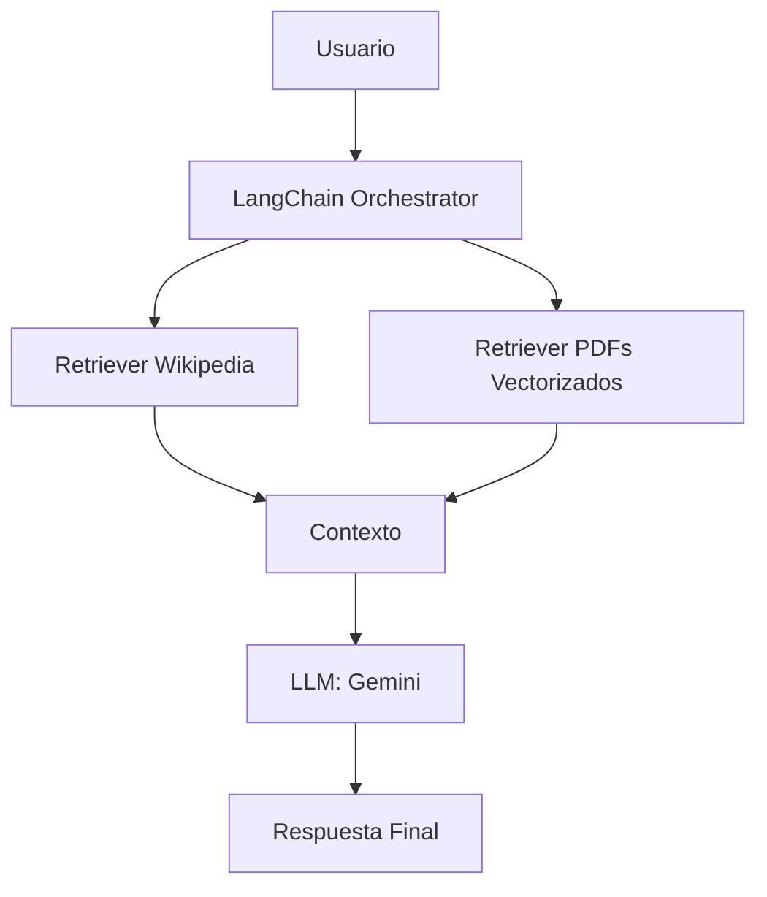

# LLM_Chatbot_Gemini_wiki_pdf_Fil
Desarrollar un chatbot filosófico capaz de responder preguntas sobre autores, corrientes y conceptos filosóficos usando:  
- Contenido de Wikipedia (vía API).
- PDFs de manuales filosóficos (cargados y vectorizados).
- Gemini (vía LangChain) como modelo principal de respuesta y razonamiento.


# 🧠 Chatbot Filosófico con LangChain, Gemini, Wikipedia y PDFs

Este proyecto consiste en el desarrollo de un **chatbot inteligente orientado a responder preguntas filosóficas** utilizando modelos de lenguaje avanzados e información proveniente de múltiples fuentes. Está construido con LangChain como orquestador, Gemini como modelo LLM, y conocimiento extraído de Wikipedia y manuales en PDF.

---

## 🎯 Objetivo

Crear un asistente conversacional capaz de responder consultas filosóficas de manera precisa, citando fuentes confiables y explicando conceptos complejos con claridad.

---

## 🏗️ Arquitectura del Pipeline



---

## 🔧 Componentes del pipeline

### 1. **Entrada del usuario**
- Pregunta libre relacionada con filosofía.

### 2. **LangChain Orchestrator**
- Determina si la respuesta se puede obtener desde Wikipedia, desde los PDFs, o ambas fuentes.
- Encadena el flujo de datos y llama a los retrievers y al modelo LLM.

### 3. **Wikipedia Retriever**
- Utiliza la API de Wikipedia a través del wrapper de LangChain.
- Extrae resúmenes concisos sobre temas filosóficos en español.

### 4. **PDF Retriever (con embeddings)**
- Procesa manuales filosóficos en PDF.
- Se vectorizan los documentos y se almacenan en FAISS o ChromaDB.
- Permite búsquedas semánticas.

### 5. **Modelo LLM (Gemini)**
- Toma el contexto recuperado y genera una respuesta clara, precisa y argumentada.
- Se puede usar vía `langchain-google-genai` o `ChatVertexAI`.

### 6. **Respuesta final**
- Se entrega al usuario, opcionalmente incluyendo referencias o fuentes consultadas.

---

## 📁 Estructura del proyecto

```
chatbot_filosofico/
├── data/                  # PDFs filosóficos
├── vector_store/          # Base de datos vectorial (FAISS o Chroma)
├── chains/                # Lógica de recuperación y QA
│   └── rag_chain.py
├── retrievers/
│   ├── wikipedia.py
│   └── pdf_vector.py
├── llm/
│   └── gemini.py
├── main.py                # Orquestador principal
├── config.yaml            # Configuraciones del sistema
└── requirements.txt
```

---

## 🛠️ Tecnologías utilizadas

- **Python**
- **LangChain**
- **Gemini (Google Generative AI)**
- **WikipediaAPI**
- **FAISS / ChromaDB**
- **OpenAI o HuggingFace Embeddings**
- **PyMuPDF / pdfminer**
- **Streamlit** (para el frontend en la siguiente etapa)

---

## 🚀 Próximos pasos

- [ ] Implementar frontend con Streamlit.
- [ ] Agregar historial conversacional.
- [ ] Agregar opción de mostrar citas/referencias.
- [ ] Desplegar en un entorno web.

---

## 👨‍💻 Autor

**Jerónimo Martínez** – Data Scientist 
